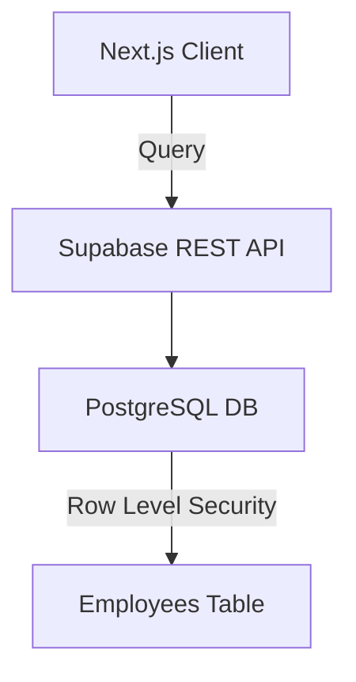
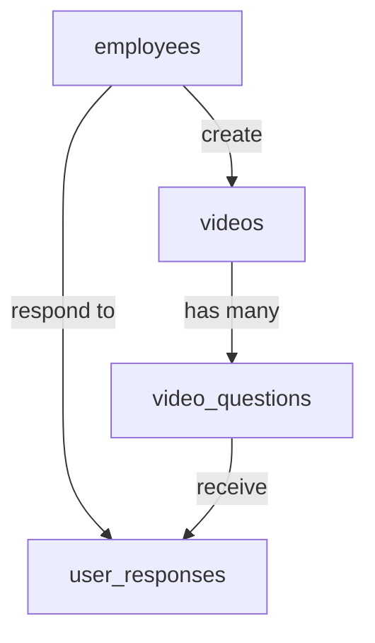

# Supabase Integration Design Doc

## 1. Project Structure Additions

```
app/
├── lib/
│   └── supabase/              # New directory
│       ├── client.ts          # Supabase client initialization
│       └── queries.ts         # Database query functions
env.local                      # For Supabase credentials
```

## 2. Core Components to Modify

- **Login Flow** (`app/login/page.tsx:6-36`)

  - Replace hardcoded check with Supabase query
  - Add loading states and error handling

- **Environment Configuration**
  - Add Supabase env vars to .env.local

## 3. Database Requirements

### Employees Table Schema

```sql
create table employees (
  id uuid primary key default uuid_generate_v4(),
  employee_number text not null unique,
  created_at timestamp with time zone default timezone('utc'::text, now()),

  -- Optional fields for future expansion
  full_name text,
  department text,
  is_active boolean default true
);

-- Security
alter table employees enable row level security;
create policy "Employee numbers visible"
on employees for select using (true);
```

## 4. Supabase Configuration

| Component          | Requirement                              |
| ------------------ | ---------------------------------------- |
| Authentication     | Anonymous auth enabled                   |
| Row Level Security | Enable RLS with select permissions       |
| SQL Indexes        | Create index on employee_number column   |
| API Rate Limiting  | Configure appropriate request thresholds |

## 5. Authentication Flow

```
Frontend (Login Page)
  → Submit employee number
  → Call Supabase query
  → Supabase (employees table lookup)
  → Return exists: true/false
  → Handle routing based on response
```

## 6. Security Considerations

- Use Supabase anonymous key for client-side operations
- Implement rate limiting on login attempts
- Store only non-sensitive employee data
- Use prepared statements for all queries
- Consider IP-based rate limiting in production

## 7. Required Supabase Services



## 8. Testing Requirements

- Employee number exists in table → Grant access
- Employee number missing → Show error
- Database connection failure → Graceful error
- Empty input handling
- Special character sanitization

## 9. Documentation Needed

1. Environment setup guide for developers
2. Supabase dashboard configuration steps
3. Database migration instructions
4. Monitoring/alerting setup for failed logins
5. Backup/restore procedures for employee data

## 10. Performance Considerations

- Cache employee number lookups (Redis optional)
- Use connection pooling
- Monitor query performance with Supabase Analytics
- Consider Edge Functions for future expansion

## 11. Database Schema Requirements

### Core Tables

```sql
create table employees (
  id uuid primary key default uuid_generate_v4(),
  employee_number text not null unique,
  created_at timestamp with time zone default timezone('utc'::text, now()),

  -- Optional fields for future expansion
  full_name text,
  department text,
  is_active boolean default true
);

-- Security
alter table employees enable row level security;
create policy "Employee numbers visible"
on employees for select using (true);
```

### Key Relationships



### Security Requirements

#### Row Level Security (RLS) Policies

1. `videos` table:

- Select: Authenticated users can view videos assigned to their department
- Insert/Update: Admin only

2. `video_questions`:

- Select: Public (questions are read-only)
- Modify: Admin only

3. `user_responses`:

- Insert: Authenticated users can create their own responses
- Read: Users can only see their own responses

## 12. Supabase Services Needed

| Service        | Usage                              |
| -------------- | ---------------------------------- |
| Database       | Core data storage                  |
| Auth           | Employee authentication            |
| Storage        | Video file hosting                 |
| Realtime       | (Optional) Live updates for admins |
| Edge Functions | (Future) Custom auth logic         |

## 13. Integration Points with Existing Codebase

- Replace hardcoded questions with Supabase fetch
- Add response submission logic
- Add video metadata loading

### New Required Components:

1. `lib/supabase/queries.ts`

- getEmployeeVideos(employeeId)
- getVideoQuestions(videoId)
- submitQuestionResponse(responseData)

2. `types/database.ts`

- Type definitions for Supabase tables
- Response DTO interfaces

## 14. Data Flow

1. Login → Verify employee → Get assigned videos
2. Start quiz → Load video + questions from Supabase
3. Answer handling → Validate against correct answer → Store response
4. Results → Aggregate responses from Supabase

## 15. Performance Considerations

1. Add indexes:

```sql
CREATE INDEX idx_video_questions ON video_questions(video_id, timestamp);
CREATE INDEX idx_user_responses ON user_responses(employee_id, question_id);
```

2. Cache strategies:

- Cache video metadata for 24h
- Cache questions for 1h (stale-while-revalidate)

3. Pagination for large response datasets

## 16. Security Considerations

1. Use Postgres policies for all RLS
2. Enable Supabase network restrictions
3. Encrypt sensitive employee data at rest
4. Rate limiting on write operations
5. Input validation for all user-generated content

## 17. Testing Requirements

1. Test scenarios:

- Employee with no assigned videos
- Video with multiple time-bound questions
- Concurrent answer submissions
- Large video files (500MB+)
- Invalid answer indexes

2. Monitoring:

- Query response times
- Storage bandwidth usage
- Failed login attempts

## 18. Migration Plan

1. Phase 1: Schema creation + historical data import
2. Phase 2: Shadow read/write testing
3. Phase 3: Full cutover with feature flag
4. Phase 4: Deprecate legacy hardcoded system

## 19. Documentation Needed

1. ER diagram for database schema
2. API reference for Supabase functions
3. Data dictionary for all tables
4. Error code reference
5. Backup/restore procedures

## 20. Environment Variables

Add to `.env.local`:

```bash
NEXT_PUBLIC_SUPABASE_VIDEO_BUCKET="training-videos"
SUPABASE_SERVICE_ROLE_KEY=""
MAX_VIDEO_SIZE_MB="500"
```

## Final Database Schema

```sql
-- Core Tables
create table employees (
  id uuid primary key default uuid_generate_v4(),
  employee_number text not null unique,
  full_name text not null,
  department text,
  created_at timestamp with time zone default now()
);

create table videos (
  id uuid primary key default uuid_generate_v4(),
  title text not null,
  video_url text not null,
  duration numeric not null,
  created_at timestamp with time zone default now()
);

create table employee_video_assignments (
  id uuid primary key default uuid_generate_v4(),
  employee_id uuid references employees(id) on delete cascade,
  video_id uuid references videos(id) on delete cascade,
  assigned_at timestamp with time zone default now(),
  unique (employee_id, video_id)
);

create table video_questions (
  id uuid primary key default uuid_generate_v4(),
  video_id uuid references videos(id) on delete cascade not null,
  timestamp numeric not null check (timestamp >= 0),
  question text not null,
  options jsonb not null,
  correct_answer numeric not null,
  question_order numeric not null,
  constraint valid_correct_answer check (
    correct_answer between 0 and jsonb_array_length(options) - 1
  )
);

create table user_responses (
  id uuid primary key default uuid_generate_v4(),
  employee_id uuid references employees(id) on delete cascade not null,
  video_id uuid references videos(id) on delete cascade not null,
  question_id uuid references video_questions(id) on delete cascade not null,
  selected_answer numeric not null,
  is_correct boolean not null default false,
  answered_at timestamp with time zone default now()
);

-- Automatic Correctness Trigger
create or replace function set_response_correctness()
returns trigger as $$
begin
  update user_responses
  set is_correct = (
    select correct_answer = NEW.selected_answer
    from video_questions
    where id = NEW.question_id
  )
  where id = NEW.id;
  return NEW;
end;
$$ language plpgsql;

create trigger check_response_correctness
after insert on user_responses
for each row execute function set_response_correctness();
```

## Key Implementation Notes

1. **Assignment Relationships**:

   - Employees ↔ Videos: Many-to-many via `employee_video_assignments`
   - Automatic cleanup with `on delete cascade`

2. **Question Ordering**:

   - Use `question_order` column instead of reserved keyword `order`
   - Maintains display sequence within video

3. **Answer Validation**:

   - Trigger-based correctness check
   - Updates `is_correct` after response insertion
   - Uses direct question ID reference for validation

4. **Data Integrity**:
   - JSON schema validation for question options
   - Range checking for correct_answer index
   - Composite unique constraints on assignments

```

This version addresses all previous errors while maintaining the core requirements. The trigger-based validation provides better flexibility for future rule changes compared to generated columns.

This doc aligns with the existing project structure and provides clear implementation guidelines while maintaining compatibility with the current authentication flow and UI components.
```
